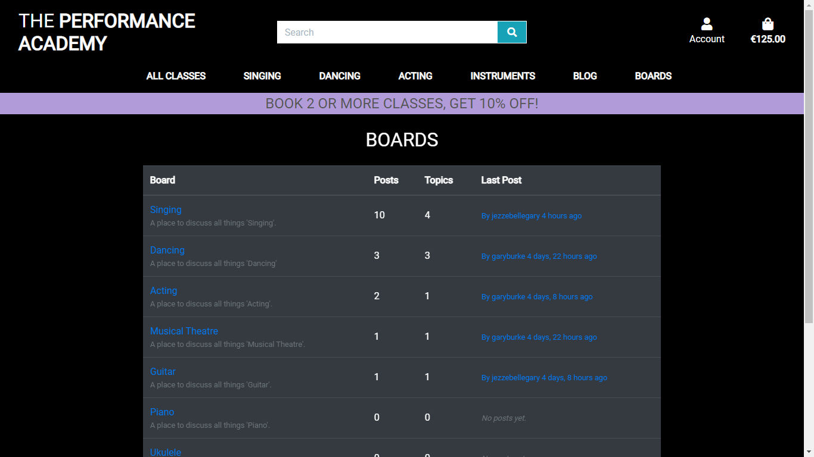
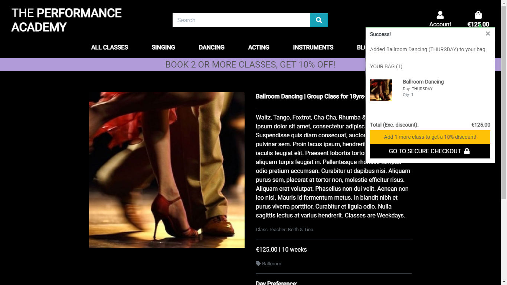

# The Performance Academy
[View the live site here.](https://the-performance-academy.herokuapp.com/)


# User Experience (UX)

## Purpose & Aim of the Project
**The Performance Academy** is an eCommerce, information and discussion website for a performing arts school that offers different types of classes for all ages. The site allows users to search for classes, book and pay (via Stripe) for them and register for an account. It also offers a blog and discussion boards where users can post, interact and converse.

## Design Process
Before laying out the site and creating the initial design, some market research was done and the following queries were brought to the fore;
-   Do other performing arts schools offer similar classes and online booking mechanisms?
-   If so, what is their design, how do their sites look?
-   What are common design concepts across performing arts school sites that should be included?
-   What's missing, that I can add.
-   Which ones, or what parts of them do I like?
-   What concepts fit in with my school's idea?

There are many performing arts schools and sites out there with a wide range of ideas. I wanted this one to be minimalist, with a dark 'cool' theme that appeals to most ages but most importantly I wanted people to be able to find what they want, book and pay for it with as little steps as possible. After that, I wanted to create the beginnings of a community for people interested in the performing arts.

## Target Group
The site is aimed at both parents and students of all ages, as the school offers classes from ages 3yrs up to adults. The typical age of a shopper is estimated to be between 18 and 45 years but may be influenced by the child who may want to attend a particular class. The classes have a diverse spread of disciplines to entice as many students to participate in their preferred field. The income of the target group is an average mid to high household income. Furthermore the target group has a passion for engaging in extracurricular activities.

## User stories
Before the start of the project, user stories were defined and written out to have a complete set of necessary features to get the site going, broken down as follows;
-   Regular **site visitors**.
-   **Registered users**.
-   **Site/school owner**.

### Browsing the Site
As a **site visitor**, I want to...
-   access the site on any device (smartphone, tablet, desktop), so that I am able to visit the site anytime and anywhere.
-   have easy navigation, to quickly solve the reason for my visit.
-   have information about the brand, to get to know the classes and understand what they entail.

### Browsing Classes
As a **site visitor**, I want to...
-   browse classes by category and type, so that I can quickly find what I am looking for.
-   sort classes to adjust the order according to my needs.
-   be able to search for specific classes, to quickly find what I need.
-   access class details, to get more information on the class.
-   be able to choose a class, to book according to my needs.
-   read information about performing arts in general, with a view to exploring new classes / styles.

### Manage Shopping Bag and Make Booking
As a **site visitor**, I want to...
-   see all my items in a shopping bag, so that I have an overview of my potential booking.
-   be able to reduce / increase quantity, so that I can order my preferred amount.
-   be able to remove an item from my cart, so that I can manage my shopping bag efficiently.
-   be able to checkout from the cart view, so that I can quickly finish my booking.
-   be able to pay for a booking by credit card, so that I don't have to deal with an invoice and money transfer.
-   receive a booking confirmation, so that I know my booking was completed.

As a **registered user**, I want to...
-   store my details in my profile, so that I can quickly finish my booking.

### Registration & User account
As a **site visitor**, I want to...
-   be able to sign up to the site, so that I can track bookings and have my data prefilled in the order form.

As a **registered user**, I want to...
-   be able to login, so that I can access my user account.
-   be able to see my order history, so that I know what bookings I've made before.
-   manage my personal details, so that I can quickly update my data if something changes.
-   post new topics and/or replies to the boards section of the site.

### Site Management
As a **site owner**, I want to...
-   be able to manage the classes, categories, price and availability, so that I have an overview of all class details.
-   view customer conversations & comments, so that I can quickly update the site when required.
-   create, edit or delete articles to post in the blog, for site users to read.
-   create, edit or delete boards, topics and posts in the boards app to maintain proper moderation.

# Layout, Styling & Wireframes

## Structure
There are 9 main pages including the home page and a login/registration page. Other than these, there is a base page which serves as the base for all the other pages.

### Home Page
The home page gives a quick glance at the brand of the site and a link to the booking page.

### Booking/Classes Page
This page provides a list of classes which users can book. There are filters and a sort function to aid in the search. Once they click into a class, it takes them to a page which provides a bit more information about that class and from here, they can add it to their shopping bag.

### Shopping Bag Page
Users can add this to their shopping bag and go to checkout or keep adding more classes. The shopping bag shows the total which is calculated automatically based on the classes they add. They can delete the class if no longer required or if they want to add more classes, there is a button which takes them back to book more classes. Once they have added all the classes to the shopping bag, they can go to the Checkout page by clicking on the checkout button link.

### Checkout Page
Here the user can enter their billing details to complete the checkout. If they need to update the shopping bag at any point before billing, they have the option to go back to the main site by clicking on a button. In this page, the users are provided with an option to save their details by logging into the site. If they don't want that option, they can click on Complete Order button to complete the transaction which triggers an automatic mail to their email address provided with the necessary details. If they want to save the details for future, they can register or login from the page or from the navbar.

### Login Page
The users are provided with the option to register/login to create an account. For new users, they can redirect to the Sign up page from here. They need to include their email address, name and password to sign up. Once that is done, a confirmation link will be sent to their email address. Once the email is confirmed, they can login to the site. Logged in users have the ability to navigate to the Profile page and post a topic / reply in the Boards app.

### Profile Page
Logged in users can update their billing details from this page. If they have made any previous bookings, those details are also shown on this page. [view](media/tpa_user_profile.jpg)

### Logout Page
For users logged in, they can click on the logout button which takes them to this page to confirm that they want to logout. Clicking on the Sign out button logs them out from the site.

### Blog Page
Admin can post articles to the blog and they will show up here, in Bootstrap cards. Article content is truncated and users can click on a 'read more' link to be taken to the full article. From here they can then also click on a 'back to blog' link to get back to the main blog page.

### Boards Page


All users can view the Boards page which is a table with links to all the different boards available. Clicking on a board title will take the user to that boards topic page, where a bunch of topics will be listed. A logged in user can add a new topic here. All users can read topic posts by clicking on the topics title. A logged in user can post to a topic or post a reply in a topic. Only a user who created a post, or admin, can delete that post.

### Site Management


This is available only for admin. Once logged in, the Account dropdown menu contains the followings links;
-   Add a class page - to add a new class to the site. [view](media/tpa_add_class.jpg)
-   Post to blog page - to add a new article to the blog. [view](media/tpa_add_article.jpg)

Separate to these links, edit & delete links show up for admin on all class detail pages and on all blog articles for quick access to these functions.
-   Class detail Edit/Delete [view](media/tpa_admin_links_2.jpg)
-   Blog Article Edit/Delete [view](media/tpa_admin_links_1.jpg)

### Other Features
-   Scroll to top button added which is a convenience especially when viewing from tablet or mobile.
-   Message success/alert/error/warning toasts (from Bootstrap) depending on the function. These can be closed by clicking the 'x' button.

### Surface
-   The website is created in an easily navigable manner with sections added in the navbar. When user is not logged in, the login/register page shows. When the user is logged in, My Profile appears and Login link turns to Logout.
-   Buttons and links - the information architecture is placed logically depending on the page
-   The site is using a clean, minimalistic approach with a dark, modern theme.
-   Roboto 2.0 (from Google fonts) was used throughout the site.

### Wireframes
Here are the designs I made for the site:
-   [Home page on desktop](media/tpa_wf1.jpg)
-   [Classes page on desktop](media/tpa_wf2.jpg)
-   [Index, Classes and Class Detail pages on smartphones](media/tpa_wf3.jpg)
-   [Shopping Bag popup, Checkout and Checkout Success pages on smartphones](media/tpa_wf4.jpg)
-   [Blog, Boards and Profile pages on smartphones](media/tpa_wf5.jpg)
-   [Board Posts and Board Reply/Add page on tablets](media/tpa_wf6.jpg)
-   [Add/Edit Class and Sign Out pages on tablets](media/tpa_wf7.jpg)
-   [DB Entity Relationship Diagram](media/erd_tpa.jpg)

## Detailed Features

### Visible to all users


-   **Index page** - Upon entering the site the user is greeted by the main nav, a discount banner, a large performing arts background image, a 'New Term Now Enroling' statement and a call-to-action button.
-   **Main Nav Menu** - The main menu (collapsed on mobile devices) features dropdown lists where the user can select classes and categories as follows;
    -   Classes by age, price, category or all classes.
    -   Singing classes in the following categories: Rock/Pop, Opera/Classical, Musical Theatre or all singing.
    -   Dancing classes in the following categories: Ballet, Hip Hop, Tap, Ballroom, Musical Theatre or all dancing.
    -   Acting classes in the following categories: Stage, Screen, Improv, Musical Theatre or all acting.
    -   Instrument classes in the following categories: Piano, Guitar, Bass Guitar, Drums, Ukulele or all instruments.
-   **Main Nav Search Box** - Always visible. Searches class names and descriptions using Django models object 'Q' to handle the users query in the database.
-   **Main Nav Account** - Always visible dropdown menu to register or login.
-   **Main Nav Shopping Bag** - Always visible link to the session users shopping bag, which also contains the current total cost of items in the bag.
-   **Discount Banner** - Always visible to remind users they can receive a discount by booking more than 1 class.
-   **Classes page** - This is main page of the site which features a list of available classes displayed in bootstrap cards. The list of classes can be sorted directly from the 'sort by...' dropdown which includes age (youngest-oldest/oldest-youngest), price (low-high/high-low), name (a-z/z-a) or category (a-z/z-a). When a user selects a certain category or group of categories ('All Singing' for example) from the main menu, all classes in that category / those categories will be listed on the classes page, with an array of bootstrap badges displaying on top which are also quick links to categories themselves. Click on the image of any class to see further details about that class.
-   **Class Detail page** - The class detail page contains more information about a given class, such as a full description, the teacher, what day it takes place etc. It also allows the user to add the class to their shopping bag. Some classes take place on weekdays ('Junior Voice' for example) and with this in mind the user can select their preferred day (Monday-Friday). This function is disabled for classes that take place only on one day. The user can click a button to add an item to their bag or keep shopping. If the user adds an item to their bag, a success message pops up with a summary of the bag contents and a link to go to checkout. This popup also features a discount reminder (if the user has only bought one class they will see a message stating 'Add 1 more class to get a 10% discount!') unless the user has already added more than one item to their bag, in this case the reminder will not show up.
-   **Shopping Bag page** - The user can at any point click on the 'bag' link in the main nav to see a full, detailed list of their items. From here the user can update their bag by removing items or increasing the quantity of items. They can also click a button to go to checkout or keep shopping. Again, this page features a discount reminder (if the user has only bought one class they will see a message stating 'You could get a 10% discount by adding 1 more class!') unless the user has already added more than one item to their bag, in this case the reminder will not show up.
-   **Checkout page** - The user will be prompted to enter their contact details, billing information and credit card number into the checkout form and see a summary of their order. The user will have the option to 'Create an account' or 'Login' to save this information on their profile. They will also have the option to complete order or adjust bag with buttons at the bottom of the page. If the user leaves a mandatory field (denoted by *) blank, they will be prompted to 'please fill out this field'. If the user enters an invalid card number, they will receive an on-screen message stating the same.
-   **Checkout Success page** - If a user makes a successful transaction they are taken to the checkout success page which features a popup success message (with order number), their full order information and a message stating that a confirmation email has been sent to the email they submitted on the checkout form.
-   **Boards page** - This page features a simple bootstrap table with a list of the current discussion boards (as created by the superuser), their title (a clickable link to go to that board and see a list of topics) how many posts & topics they each contain and when the last post was made on that board (a clickable link to go to that post).
-   **Topics page (Boards)** - Each board contains a topics page, which is a simple bootstrap table containing all the topics under that board heading. The user will see topic title (a clickable link to go to that discussion topic), the name of the user who started the topic, how many replies it has received, how many views it has received and when it was last updated. There is also a button to allow registered users to add a new topic. If a non-registered user clicks this button, they will be prompted to login or register.
-   **Topic Posts page (Boards)** - Each topic contains a posts page, which is a list (in descending chronological order) of replies to that topic. There is a button to allow registered users to reply. If a non-registered user clicks this button, they will be prompted to login or register.
-   **Blog page** - This page features a list of blog posts (as made by the superuser) laid out as bootstrap cards. Each card features an image, post title, article and 'posted by' information. Blog articles are truncated and a read more link has been added which takes the user to the 'Blog Detail' page.
-   **Blog Detail page** - This page features the full article of any blog post, and allows the user to link back to the main blog by way of a button link.
-   **Register / Sign Up page** - This page allows users to register with a simple form requesting the users email address, username and password. It allows the user to return to the login page if they are already registered.
-   **Login / Sign In page** - Allows already registered users to sign in with their username and password. Allows users to go to the register page if they are not yet registered, prompting them to sign up. Features a 'remember me' checkbox, telling the browser to save a cookie so that if the user closes out the window for the site without signing out, the next time they go back, they will be signed back in automatically.

### Visible to registered users
-   **Profile page** - This page features the username and 'billing details' (if they have been saved). It also features an order history.
-   **Edit Post page (Boards)** - Allows a registered user to edit any post they have made, featuring a simple 'message' input field and a 'save changes' button.
-   **New Topic page (Boards)** - Allows a registered user to add a new topic to a board, features a 'subject' input field, 'message' input field and a 'post' button.
-   **Reply Topic page (Boards)** - Allows a registered user to post a reply on any topic, features a simple 'message' input field and a 'post a reply' button.

### Visible to superuser (admin)
-   **Add Class page** - An 'add class' link appears in the 'account' dropdown menu item allowing the superuser to add a new class by way of a form. The form features a dropdown selection of categories and input fields for sku, name, description, day information, price, age, setting (group/solo), teacher, term and image.
-   **Edit/Delete (Class)** - If superuser is logged in, edit and delete links appear on each class card and on the class detail page for quick access to these functions.
-   **Edit Class page** - Features the same form as the 'add class' page but is pre-populated with the current information about a given class.
-   **Add Article page** - An 'post to blog' link appears in the 'account' dropdown menu item allowing superuser to add a new article to the blog by way of a form featuring author, title, body, date and image input fields.
-   **Edit/Delete (Article)** - If superuser is logged in, edit and delete links appear on each blog detail page for quick access to these functions.
-   **Edit Article page** - Features the same form as the 'add article' page but is pre-populated with the current information of that particular blog article.
-   **Delete Board / Topic / Post** - If superuser is logged in, a delete link appears beside each board, topic and post in the boards app for quick access to this function and to enable proper moderation.

# Technologies Used

## Databases
-   [SQLite](https://www.sqlite.org/)
-   [PostgreSQL](https://www.postgresql.org/)

## Languages
-   [HTML](https://www.w3schools.com/html/)
-   [CSS](https://www.w3schools.com/css/)
-   [JavaScript](https://www.javascript.com/)
-   [Python](https://www.python.org/)

## Frameworks
-   [Bootstrap](https://getbootstrap.com/)
-   [Django](https://www.djangoproject.com/)
-   [jQuery](https://jquery.com/)

## Libraries & Tools
-   [Google Fonts](https://fonts.google.com/)
-   [Gitpod](https://www.gitpod.io/)
-   [Boto3](https://boto3.amazonaws.com/v1/documentation/api/latest/index.html)
-   [Coverage](https://coverage.readthedocs.io/en/v4.5.x/)
-   [Dj-Database-URL](https://pypi.org/project/dj-database-url/)
-   [Django-Countries](https://pypi.org/project/django-countries/)
-   [Django-Heroku](https://pypi.org/project/django-heroku/)
-   [Django-Storages](https://django-storages.readthedocs.io/en/latest/)
-   [Django-Crispy-Forms](https://django-crispy-forms.readthedocs.io/en/latest/)
-   [Git](https://git-scm.com/)
-   [GitHub](https://github.com/)
-   [Gunicorn](https://pypi.org/project/gunicorn/)
-   [Jigsaw CSS Validation](https://jigsaw.w3.org/css-validator/)
-   [JS Hint](https://jshint.com/)
-   [PEP8](http://pep8online.com/)
-   [Pillow](https://pillow.readthedocs.io/en/stable/)
-   [PIP](https://pip.pypa.io/en/stable/installing/)
-   [Psycopg2](https://pypi.org/project/psycopg2/)
-   [Stripe](https://stripe.com/gb)
-   [W3C HTML Validation](https://validator.w3.org/)
-   [Whitenoise](http://whitenoise.evans.io/en/stable/)
-   [Humanize](https://pypi.org/project/django-humanize/)
-   [Widget Tweaks](https://pypi.org/project/django-widget-tweaks/)
-   [Beautify Tools](https://beautifytools.com/)

## Deployment & Hosting
- [Heroku](https://www.heroku.com/)

# Testing
A detailed and comprehensive description about the testing process and results can be found in [TESTING.md](TESTING.md)

# Deployment
This site is deployed to heroku and the versioning was done with git and the Repository is hosted on Github.

## Prerequisites to work with this Site
This project can be used for development with the following tools;
- IDE of choice (I prefer Gitpod).
- Python3, PIP & Git should be installed.

Furthermore accounts with the following services are used in this project:
- [Stripe](https://stripe.com/)
- [Gmail](www.gmail.com)

## Local Deployment: Step-by-Step Instructions
Official Github Documentation on cloning a repository: [Github - Cloning Repos](https://docs.github.com/en/free-pro-team@latest/github/creating-cloning-and-archiving-repositories/cloning-a-repository)
1. Navigate to Main page of the repository
2. Click on "Code" button
3. Choose "Clone with HTTPs" & copy URL
4. Open Terminal
5. Change the current working directory to preferred location
6. Type git clone and paste copied URL ```git clone https://github.com/garyburke888/the_performance_academy_v1.git```
7. Press Enter to create local Clone - Make sure your environment supports python3 -
8. Type ```pip3 install -r requirements.txt``` into Terminal
9. Setup the environment variables. This process is different depending on the used IDE. Gitpod supports global Environments for the development process. Therefore they were stored in the settings. The following variables are needed;
    ```
    DEVELOPMENT=True   
    STRIPE_PUBLIC_KEY = <YOUR STRIPE_PUBLIC_KEY>
    STRIPE_SECRET_KEY = <YOUR STRIPE_SECRET_KEY>
    STRIPE_WH_SECRET = <YOUR STRIPE_WH_SECRET>
    ```
10. Migrate the models and create the database by typing the following commands into the terminal;
    1. ```python3 manage.py makemigrations```  
    2. ```python3 manage.py migrate```
11. Import the provided fixtures in the correct order;
    1. ```python3 manage.py loaddata categories```
    2. ```python3 manage.py loaddata ages```
    3. ```python3 manage.py loaddata settings```
    4. ```python3 manage.py loaddata classes```
12. Create a superuser for accessing the django admin view with the following command:
    ```python3 manage.py createsuperuser``` You will be asked for an email address, username and password.
13. You should be all set and when using the command ```python3 manage.py runserver``` the project should run.
14. You can access the django admin view by adding ```~/admin``` to the end of your (local) URL.

## Deployment to Heroku: Step-by-Step Instructions
This project is deployed to Heroku. For the deployment the following steps were/are necessary:
1. Create/Log in to your Heroku account and create a new App.
2. Install Heroku Add-on Heroku Postgres from the Resources tab. The free ```Hobby Dev``` version is fine. Now click the Provision button to add it to your project.
3. Create requirements.txt from your project with the help of ```pip3 freeze --local > requirements.txt``` (already provided within the repository)
4. Create a Procfile ```echo web: gunicorn puffins.wsgi:application > Procfile``` (already provided within the repository)
5. Commit changes to Git ```git add .``` followed by ```git commit -m "Deploy: Updated Procfile"``` (already provided within the repository)
6. Set the environment variables in Heroku Settings > Reveal Config Variables
    The following Variables must be set;
    ```
    DATABASE_URL = <YOUR DATABASE_URL> (Set by Heroku Postgres)
    EMAIL_HOST_USER = <YOUR EMAIL_HOST_USER>
    EMAIL_HOST_PASSWORD = <YOUR EMAIL_HOST_PASSWORD>
    SECRET_KEY = <YOUR SECRET_KEY>
    STRIPE_PUBLIC_KEY = <YOUR STRIPE_PUBLIC_KEY>
    STRIPE_SECRET_KEY = <YOUR STRIPE_SECRET_KEY>
    STRIPE_WH_SECRET = <YOUR STRIPE_WH_SECRET>
    ```
7. Extract the DATABASE_URL Value from the Heroku Settings and set it up in your IDE or local .env file. Make sure to keep this DATABASE_URL a secret and definitely don't commit it to Github.
8. To test if the Postgres database is connected to your IDE you can make use of the command ```python3 manage.py showmigrations```. This should show undone migrations for all models.
9. Now migrate the models and create the postgres database on heroku by typing the following commands into the terminal;
    1. ```python3 manage.py makemigrations```  
    2. ```python3 manage.py migrate```
10. To setup the data in the database import the provided fixtures in the correct order; 
    1. ```python3 manage.py loaddata categories```
    2. ```python3 manage.py loaddata ages```
    3. ```python3 manage.py loaddata settings```
    4. ```python3 manage.py loaddata classes```
11. Create a superuser for the Postgres database for accessing the django admin view with the following command:
    ```python3 manage.py createsuperuser``` You will be asked for an email address, username and password.
12. Log in to heroku from your terminal ```heroku login```
13. Add existing repository to Heroku heroku ```git:remote -a <your repository>```
14. Push changes to Heroku ```git push heroku master```
15. To serve static and media files I've used WhiteNoise;
    1. pip3 install whitenoise
    2. add 'whitenoise.middleware.WhiteNoiseMiddleware', to the middleware section in settings.py
16. Finally, visit the app url from heroku and check out your great site!

# Credits

## Media
-   All sample images used on the site were taken from google images.
-   Home page image - [Martin O'Connor](http://www.martinoconnorphoto.com/)

## Tutorials
-   This app was built in conjunction with The Code Institute 'Full Stack Frameworks with Django' module.
-   [Tutorial 1](https://www.pythonistaplanet.com/how-to-create-blog-using-django/) - used to help create the 'Blog' app.
-   [Tutorial 2](https://simpleisbetterthancomplex.com/series/2017/09/04/a-complete-beginners-guide-to-django-part-1.html) - used to help create the 'Boards' app.

## Acknowledgements
-   Mentor - Gerry McBride
-   Tutor Support - Code Institute
-   Developer - Gary Burke

## Fair use disclaimer
This is for educational use.